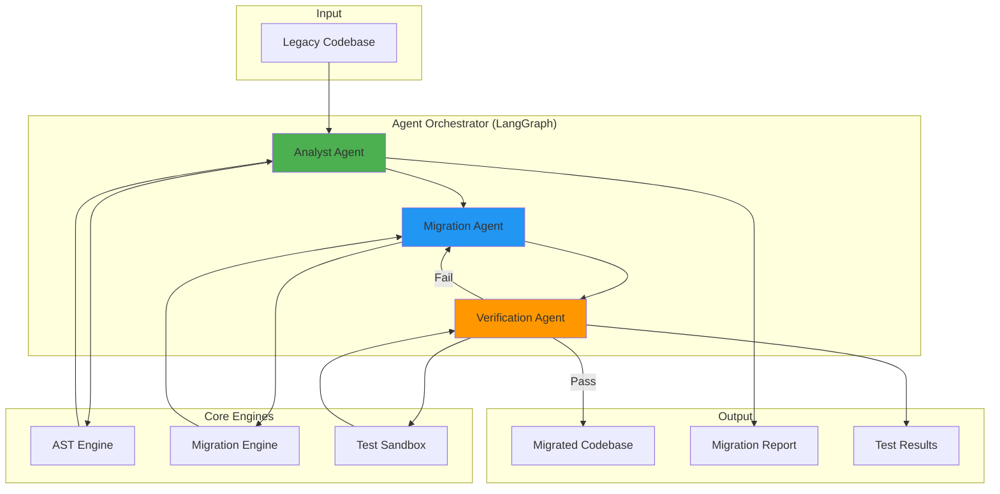

# Code-Morph: Autonomous Multi-Agent Repository Migration Engine

## 🎯 Project Vision

Code-Morph is a portfolio-defining AI DevOps Agent that automates the migration of legacy codebases to modern standards. Unlike simple text-replacement tools, this is a **semantically aware transformation engine** that understands code structure, dependencies, and behavior.

### Key Differentiators
- **AST-Driven Analysis**: Deep understanding of code structure, not just pattern matching
- **Multi-Agent Architecture**: Specialized agents working in orchestrated harmony
- **Zero Logical Drift**: Automated verification ensures migrated code behaves identically
- **Production-Grade**: Built with type safety, error handling, and scalability in mind

---

## 🏗️ System Architecture



### Agent Responsibilities

#### 1️⃣ **Analyst Agent** (AST-Driven)
- Parses codebase using AST (libcst for Python, ts-morph for TypeScript)
- Maps dependency graphs
- Identifies deprecated APIs and anti-patterns
- Generates structured Migration Plan (JSON schema)

#### 2️⃣ **Migration Agent** (The Transformer)
- Executes transformations based on Migration Plan
- Uses SOTA LLMs for semantic code generation
- Applies modern idioms and performance optimizations
- Maintains code style and documentation

#### 3️⃣ **Verification Agent** (The Sandbox)
- Generates unit tests for legacy and migrated code
- Executes tests in isolated Docker containers
- Compares outputs to ensure behavioral equivalence
- Provides detailed failure reports for iteration

---

## 📁 Production-Grade Directory Structure

```
code-morph/
├── src/
│   ├── ast_engine/              # AST parsing and analysis
│   │   ├── __init__.py
│   │   ├── parsers/
│   │   │   ├── __init__.py
│   │   │   ├── python_parser.py      # libcst-based Python parser
│   │   │   ├── typescript_parser.py  # ts-morph wrapper
│   │   │   └── base_parser.py        # Abstract base class
│   │   ├── analyzers/
│   │   │   ├── __init__.py
│   │   │   ├── dependency_analyzer.py
│   │   │   ├── api_detector.py       # Deprecated API detection
│   │   │   └── pattern_matcher.py
│   │   └── schemas/
│   │       ├── __init__.py
│   │       └── ast_models.py         # Pydantic models for AST data
│   │
│   ├── migration_engine/        # Code transformation logic
│   │   ├── __init__.py
│   │   ├── transformers/
│   │   │   ├── __init__.py
│   │   │   ├── python_transformer.py
│   │   │   ├── typescript_transformer.py
│   │   │   └── base_transformer.py
│   │   ├── llm_integration/
│   │   │   ├── __init__.py
│   │   │   ├── prompt_templates.py
│   │   │   └── llm_client.py         # OpenAI/Anthropic client
│   │   └── schemas/
│   │       ├── __init__.py
│   │       └── migration_models.py   # Pydantic models
│   │
│   ├── test_sandbox/            # Verification and testing
│   │   ├── __init__.py
│   │   ├── docker_manager.py         # Docker container orchestration
│   │   ├── test_generator.py         # Auto-generate unit tests
│   │   ├── test_executor.py          # Run tests in sandbox
│   │   ├── comparator.py             # Compare legacy vs migrated
│   │   └── schemas/
│   │       ├── __init__.py
│   │       └── test_models.py        # Pydantic models
│   │
│   ├── agent_orchestrator/      # LangGraph-based orchestration
│   │   ├── __init__.py
│   │   ├── graph_builder.py          # LangGraph workflow definition
│   │   ├── agents/
│   │   │   ├── __init__.py
│   │   │   ├── analyst_agent.py
│   │   │   ├── migration_agent.py
│   │   │   └── verification_agent.py
│   │   ├── state.py                  # Shared state management
│   │   └── schemas/
│   │       ├── __init__.py
│   │       └── orchestrator_models.py
│   │
│   ├── utils/
│   │   ├── __init__.py
│   │   ├── file_handler.py
│   │   ├── logger.py
│   │   └── config.py
│   │
│   └── main.py                  # CLI entry point
│
├── tests/
│   ├── unit/
│   │   ├── test_ast_engine/
│   │   ├── test_migration_engine/
│   │   ├── test_test_sandbox/
│   │   └── test_orchestrator/
│   ├── integration/
│   │   └── test_end_to_end.py
│   └── fixtures/
│       ├── legacy_samples/           # Sample legacy code
│       └── expected_outputs/         # Expected migrated code
│
├── examples/
│   ├── tensorflow_to_pytorch/
│   │   ├── input/
│   │   └── output/
│   └── react_class_to_nextjs/
│       ├── input/
│       └── output/
│
├── docker/
│   ├── Dockerfile.sandbox            # Sandbox environment
│   └── docker-compose.yml
│
├── config/
│   ├── migration_rules/              # Language-specific rules
│   │   ├── python.yaml
│   │   └── typescript.yaml
│   └── llm_prompts/
│       ├── analysis_prompts.yaml
│       └── transformation_prompts.yaml
│
├── outputs/                          # Generated artifacts
│   ├── migration_plans/
│   ├── migrated_code/
│   ├── test_reports/
│   └── videos/                       # Portfolio demo videos
│
├── docs/
│   ├── architecture.md
│   ├── api_reference.md
│   └── migration_guides/
│
├── .env.example
├── .gitignore
├── pyproject.toml                    # Poetry configuration
├── requirements.txt
├── README.md
└── LICENSE
```

---

## 🚀 Project Phases

### **Phase 1: Foundation & AST Engine** (Weeks 1-2)

#### Objectives
- Set up project structure and development environment
- Implement AST parsing for Python (libcst)
- Build Migration Plan generator
- Create Pydantic schemas for type safety

#### Deliverables
- [ ] Project scaffolding with Poetry/pip
- [ ] Python AST parser with dependency analysis
- [ ] Migration Plan JSON generator
- [ ] Unit tests for AST engine
- [ ] **Demo**: CLI tool that analyzes a legacy Python file and outputs a Migration Plan

#### Key Technologies
- `libcst`: Python AST manipulation
- `pydantic`: Type-safe schemas
- `networkx`: Dependency graph visualization
- `rich`: Beautiful CLI output

---

### **Phase 2: Migration Engine & LLM Integration** (Weeks 3-4)

#### Objectives
- Implement code transformation logic
- Integrate LLM for semantic transformations
- Build prompt engineering system
- Handle edge cases and error recovery

#### Deliverables
- [ ] Base transformer architecture
- [ ] Python transformer (TensorFlow → PyTorch example)
- [ ] LLM client with retry logic and rate limiting
- [ ] Prompt template system
- [ ] **Demo**: Migrate a simple TensorFlow 1.x script to PyTorch 2.5

#### Key Technologies
- `openai` / `anthropic`: LLM APIs
- `jinja2`: Prompt templating
- `tenacity`: Retry logic
- `tiktoken`: Token counting

---

### **Phase 3: Verification Sandbox** (Weeks 5-6)

#### Objectives
- Build Docker-based test sandbox
- Implement test generation
- Create output comparison system
- Ensure zero logical drift

#### Deliverables
- [ ] Docker container manager
- [ ] Automated test generator (using LLM)
- [ ] Test executor with timeout handling
- [ ] Output comparator with diff visualization
- [ ] **Demo**: Show side-by-side test results proving behavioral equivalence

#### Key Technologies
- `docker-py`: Docker SDK
- `pytest`: Test framework
- `deepdiff`: Deep comparison
- `coverage`: Code coverage analysis

---

### **Phase 4: Agent Orchestration with LangGraph** (Weeks 7-8)

#### Objectives
- Design LangGraph workflow
- Implement feedback loops
- Add state management
- Create monitoring and logging

#### Deliverables
- [ ] LangGraph workflow definition
- [ ] Three specialized agents (Analyst, Migration, Verification)
- [ ] State persistence and recovery
- [ ] Feedback loop for failed tests
- [ ] **Demo**: End-to-end migration with agent collaboration

#### Key Technologies
- `langgraph`: Agent orchestration
- `langchain`: Agent utilities
- `redis` / `sqlite`: State persistence
- `prometheus`: Metrics (optional)

---

### **Phase 5: TypeScript Support & Advanced Features** (Weeks 9-10)

#### Objectives
- Add TypeScript/JavaScript support
- Implement React → Next.js migration
- Build configuration system
- Add CLI improvements

#### Deliverables
- [ ] TypeScript AST parser (ts-morph)
- [ ] React class → Next.js Server Components transformer
- [ ] YAML-based migration rules
- [ ] Rich CLI with progress bars and interactive prompts
- [ ] **Demo**: Migrate a React class component app to Next.js 15

#### Key Technologies
- `ts-morph`: TypeScript AST
- `@babel/parser`: JavaScript parsing
- `inquirer`: Interactive CLI
- `typer`: Modern CLI framework

---

### **Phase 6: Polish, Testing & Portfolio Presentation** (Weeks 11-12)

#### Objectives
- Comprehensive testing
- Documentation
- Create portfolio demo video
- Deploy example migrations

#### Deliverables
- [ ] 90%+ test coverage
- [ ] Complete documentation
- [ ] Portfolio demo video showing:
  - Legacy repo analysis
  - Migration process with agent collaboration
  - Verification results
  - Final migrated, tested codebase
- [ ] Public GitHub repo with examples
- [ ] Blog post / technical writeup

---

## 🎬 Portfolio Demo Script

### Video Structure (5-7 minutes)

#### Act 1: The Problem (1 min)
- Show a broken legacy TensorFlow 1.x codebase
- Highlight deprecated APIs, compatibility issues
- "Manual migration would take days/weeks"

#### Act 2: Code-Morph in Action (3-4 min)
- Run CLI: `code-morph migrate --source ./legacy --target pytorch`
- **Analyst Agent**: Show Migration Plan JSON being generated
- **Migration Agent**: Watch code transformation in real-time
- **Verification Agent**: Show tests running in Docker sandbox
- Display agent communication and feedback loops

#### Act 3: The Result (1-2 min)
- Side-by-side comparison: legacy vs migrated
- Show test results: 100% behavioral equivalence
- Run the migrated code successfully
- Display migration report with metrics

#### Closing
- "From broken legacy to modern, verified codebase in minutes"
- Show GitHub repo, tech stack, architecture diagram

---

## 🔒 Security & Best Practices

### Type Safety
```python
# All agent communication uses Pydantic schemas
from pydantic import BaseModel, Field
from typing import List, Dict, Optional

class MigrationPlan(BaseModel):
    """Strictly typed migration plan"""
    file_path: str = Field(..., description="Path to file being migrated")
    deprecated_apis: List[str] = Field(default_factory=list)
    transformations: List[Dict[str, str]]
    confidence_score: float = Field(ge=0.0, le=1.0)
    estimated_complexity: str = Field(pattern="^(low|medium|high)$")
```

### Error Handling
- Comprehensive try-except blocks with specific error types
- Graceful degradation for LLM failures
- Retry logic with exponential backoff
- Detailed error logging with context

### Sandbox Security
- Docker containers with no network access
- Resource limits (CPU, memory, time)
- Read-only file system mounts
- Automatic cleanup after execution

### Code Quality
- Type hints throughout (`mypy` strict mode)
- Linting with `ruff` / `pylint`
- Pre-commit hooks for formatting
- CI/CD with GitHub Actions

---

## 📊 Success Metrics

### Technical Metrics
- **Migration Accuracy**: 95%+ semantic equivalence
- **Test Pass Rate**: 100% for verified migrations
- **Performance**: <5 minutes for typical small project
- **Code Coverage**: 90%+ test coverage

### Portfolio Impact
- **Complexity**: Multi-agent system with LLM integration
- **Innovation**: AST-driven semantic understanding
- **Completeness**: End-to-end automated workflow
- **Presentation**: Professional demo video

---

## 🛠️ Technology Stack Summary

| Component | Technologies |
|-----------|-------------|
| **AST Parsing** | libcst, ts-morph, @babel/parser |
| **LLM Integration** | OpenAI API, Anthropic Claude |
| **Agent Orchestration** | LangGraph, LangChain |
| **Testing** | pytest, Docker, deepdiff |
| **Type Safety** | Pydantic, mypy |
| **CLI** | typer, rich, inquirer |
| **State Management** | Redis / SQLite |
| **Logging** | structlog, loguru |

---

## 🎯 Next Steps

### Immediate Actions (This Session)
1. **Set up project structure** with Poetry
2. **Implement Migration Plan generator** for Python
3. **Create first demo**: Analyze a legacy file and output JSON plan

### Week 1 Goals
- Complete AST engine foundation
- Build dependency analyzer
- Create comprehensive test suite
- Document API design

---

## 💡 Key Insights for Portfolio Presentation

### What Makes This Special
1. **Not a toy project**: Production-grade architecture with real-world applicability
2. **Multi-agent complexity**: Shows understanding of distributed AI systems
3. **Verification focus**: Demonstrates commitment to correctness, not just "it compiles"
4. **Extensible design**: Easy to add new language pairs or migration patterns

### Talking Points
- "Built a semantically aware code migration engine using AST parsing and multi-agent LLM orchestration"
- "Achieved zero logical drift through automated verification in sandboxed environments"
- "Designed for production with strict type safety, comprehensive error handling, and scalable architecture"

---

## 📚 Learning Resources

### AST Manipulation
- [libcst Documentation](https://libcst.readthedocs.io/)
- [ts-morph Guide](https://ts-morph.com/)

### LangGraph
- [LangGraph Documentation](https://langchain-ai.github.io/langgraph/)
- [Multi-Agent Systems Tutorial](https://python.langchain.com/docs/use_cases/agent_workflows)

### Docker Python SDK
- [docker-py Documentation](https://docker-py.readthedocs.io/)

---

> **Ready to start building?** Let's begin with Phase 1 by setting up the project structure and creating the Migration Plan generator! 🚀
